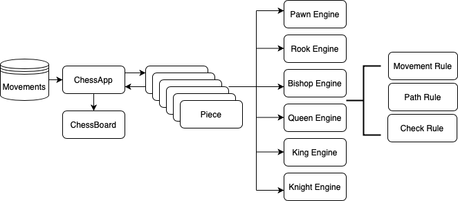

# ScalaChess

Application to run Chess games through movements loaded from external [files](src/main/resources/) resources.

Each ```Movement``` use a ```Piece``` which contains an ``Engine`` with the rules of how it 
can move through the board, and also if each move end up in a Check or Checkmate.

# 


After each movement we render in console the board in ASCII

````

闩ㄩセㄖ ⼕卄🝗丂丂

PLAYER 1: 8                                                 PLAYER 2: 8
########################################################################
     A       B        C        D        E        F        G        H       
+-------+--------+--------+--------+--------+--------+--------+--------+  
8  Rook  | Knight |        |        |  Queen | Bishop | Knight |  Rook  |

7  Pawn  |  Pawn  |        |        |  King  |  Pawn  |  Pawn  |  Pawn  |

6        |        |  Pawn  |  rook  |        |        |        | bishop |

5        |        |        |        |        |        |        |        |

4        |        |        |        |  Pawn  |        |        |  pawn  |

3        |        | knight |        |        |        |        |        |

2  pawn  |  pawn  |  pawn  |        |  pawn  |  pawn  |  pawn  |        |

1  rook  |        |        |  king  |  queen | bishop | knight |        |

+-------+--------+--------+--------+--------+--------+--------+--------+  
     A       B        C        D        E        F        G        H       
########################################################################

````

## Testing


**To go fast you have to go well** this quote of Robert C. Martin express perfectly what TDD and BDD is about. You should think first in all corner cases of your program, and then implement
one by one committing every scenario to have a quick feedback about your program.

* **Unit**: I used [scalatest](https://www.scalatest.org) together with some local mock board to Mock the board and behavior 
    for all corer case of the engines. 
* **Integration**: I also use scalatest to run the main class ```ChessApp``` together with some movement files to test the end to end of the application,
    and prove different real game scenarios

## How to run


There's two ways to build and run ```Scala Chess``` by **Docker** or **Makefile**

### Docker

To being able to build and run this project, it will require you have `````Docker deamon````` installed.

Create the docker image, running in the root folder
````
docker build -t chess .
````

Once we pass all the test and we build the image, we create a container through the images.

````
docker run chess
````

### Makefile

To being able to build and run this project, it will require you have `````sbt````` installed.

I create a **Makefile** to add all the option to interact with the platform:

* **clean:** Clean all the resources in the target folder.
* **test** Run all the testing pyramid
* **build:** Build the jar using assembly.
* **run-game:** Run the chess game passing a path where we have a file with the chess movements, and the
    chess clock to wait between each player movement

````
Makefile clean|test|build|run-game
````
